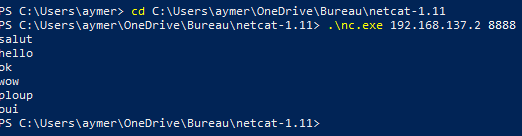

# TP Réseau 1
Aymeric MOISKA

## Exploration locale en solo

### 1. Affichage d'informations sur la pile TCP/IP locale

#### En ligne de commande

**Affichez les infos des cartes réseau de votre PC**

-> On utilise `ipconfig /all` pour les deux

- Nom, adresse MAC et adresse IP de l'interface WiFi

        Description (NOM) : Intel(R) Wi-Fi 6 AX200 160MHz
        Adresse physique (MAC) : 38-FC-98-87-A1-27
        Adresse IPv4 : 10.33.19.97

- Nom, adresse MAC et adresse IP de l'interface Ethernet

        Description (NOM) : Realtek PCIe GbE Family Controller
        Adresse physique (MAC) : 8C-8C-AA-6F-E9-6D
        Pas d'adresse IP pour l'interface Ethernet

**Affichez votre gateway**

- Adresse IP de la passerelle de votre carte WiFi
    Egalement visible grâce à `ipconfig /all`
        
         Adresse passerelle : 10.33.19.254

#### En graphique (GUI : Graphical User Interface)

**Trouvez comment afficher les informations sur une carte IP (change selon l'OS)**

- Trouvez l'IP, la MAC et la gateway pour l'interface WiFi de votre PC
On se rend dans le Centre de réseau et partage dans l'onglet Réseau et Internet du panneau de configuration Windows.
Depuis là on peut ouvrir notre type de connexion actuel et afficher ses détails.

#### Questions

**A quoi sert la gateway dans le réseau d'YNOV ?**

La passerelle, un routeur, permet aux membres du réseau d'Ynov de communiquer au delà du réseau, vers Internet ou d'autres réseaux moindres.

### 2. Modifications des informations

#### A. Modification d'adresse IP (partie 1)
Utilisez l'interface graphique de votre OS pour changer d'adresse IP :

J'ai bien perdu Internet lors de la manipulation. Il est possible de perdre l'accès car nous avons potentiellement choisi une adresse
déjà utilisé par un autre client du réseau et ce client, ayant eu cette adresse IP en premier, est prioritaire avec. Ainsi on ne reçoit rien
car c'est lui qui reçoit.

## Exploration locale en duo

### 3. Modification d'adresse IP

Nous avons choisi respectivement 192.168.129.1 et 192.168.129.2 avec pour masque réseau 255.255.255.0. (dû à un bug windows)
Après avoir modifié ces informations sur la connexion ethernet, on peut vérifier via `ipconfig /all` sous les détails de : "Carte Ethernet Ethernet".

On teste par la suite un ping vers nos adresses IP respectives :
 -> `ping 192.168.129.1`
 Résultat :
        Envoi d’une requête 'Ping'  192.168.129.1 avec 32 octets de données :
        Réponse de 192.168.129.1 : octets=32 temps=2 ms TTL=128
        Réponse de 192.168.129.1 : octets=32 temps=2 ms TTL=128
        Réponse de 192.168.129.1 : octets=32 temps=2 ms TTL=128
        Réponse de 192.168.129.1 : octets=32 temps=2 ms TTL=128

        Statistiques Ping pour 192.168.129.1:
                Paquets : envoyés = 4, reçus = 4, perdus = 0 (perte 0%),
        Durée approximative des boucles en millisecondes :
                Minimum = 2ms, Maximum = 2ms, Moyenne = 2ms

Par la suite, si on récupère les données de la table ARP via la console avec `arp -a`, on peut voir le détail suivant sous l'IP de l'autre personne sous le réseau :
        Interface : 192.168.129.2 --- 0xb
                Adresse Internet      Adresse physique      Type
                **192.168.129.1**         f4-39-09-75-4b-1f     **dynamique**

### 4. Utilisation d'un des deux comme gateway

J'ai donc activé le partage de ma connexion internet wifi via l'onglet suivant :

Ce qui a d'ailleurs changé mon adresse IP précedemment choisi pour l'ethernet, nous sommes désormais en 192.168.137.1 et .2
Celui avec le wifi coupé a donc tenté de ping 1.1.1.1 et 8.8.8.8, j'ai pu voir que ça fonctionné à travers Wireshark et donc qu'il pouvait utiliser ma connexion à internet.

### 5. Petit chat privé

Après avoir fourni une exception à Ncat pour Windows Defender et avoir une console ouverte dans le dossier du .exe,
on peut éxécuter la commande suivante pour lancer un serveur qui écoutera sur le port 8888 sans distinguer d'IP.
`.\nc64.exe -l  -p  8888`

A l'aide de la commande netstat pour afficher différentes informations sur les connexions réseaux en cours, on peut 
observer qu'il écoute sur n'importe quelle IP tant qu'elle passe par le port 8888.
        -> `netstat -a -b -n | select-string 8888`

TCP    0.0.0.0:8888           0.0.0.0:0              LISTENING

 [nc64.exe]

Pour s'y connecter, il suffit de faire la commande suivante : 
        `.\nc.exe 192.168.137.2 8888` 
et on peut maintenant discuter. 

Celui qui possède le serveur peut également préciser son IP d'un de ses réseaux, celle-ci a pour effet de restreindre le "LISTENING" du serveur a ce réseau. Ici ça revient à autoriser les connexions au netcat uniquement aux IPs partageant notre réseau ethernet.

`.\nc64.exe -l -s 192.168.137.2 -p  8888`

Comme avant avec netstat, on voit à peu près la même chose à l'exception de l'IP précisé avant le port.

TCP    192.168.137.2:8888     0.0.0.0:0              LISTENING

 [nc64.exe]

### 6. Firewall

Une fois le firewall réactivé, voici les commandes qu'on éxécute afin de créer les règles de trafic entrant pour autoriser les pings :

- `netsh advfirewall firewall add rule name="ICMP Allow incoming V4 echo request" protocol=icmpv4:8,any dir=in action=allow`
- `netsh advfirewall firewall add rule name="ICMP Allow incoming V6 echo request" protocol=icmpv6:8,any dir=in action=allow`

Il y a donc deux protocole ICMP (4 et 6) à autoriser en type 8, cad en echo request. Il n'est à priori pas nécessaire de gérer ici le cas des ICMP type 0 pour qu'on puisse réaliser nos pings.
On teste les pings et on observe que cela fonctionne désormais.

On peut vérifier si les règles ont bien été créées avec par exemple: `netsh advfirewall firewall show rule name="ICMP Allow incoming V4 echo request"`
Ce qui nous donne :
                Nom de la règle :                     ICMP Allow incoming V4 echo request
                ----------------------------------------------------------------------
                Activé :                              Oui
                Direction :                           Actif
                Profiles :                            Domaine,Privé,Public
                Groupement :
                LocalIP :                             Tout
                RemoteIP :                            Tout
                Protocole :                           ICMPv4
                                                      Type    Code
                                                      8       Tout
                Traversée latérale :                  Non
                Action :                              Autoriser
                Ok.

Pour ouvrir le port 8888 qu'on utilise pour netcat, il suffit d'utiliser une commande plus ou moins similaire à la précédente, avec celle qui suit :

- `netsh advfirewall firewall add rule name="TCP Port 8888" dir=in action=allow protocol=TCP localport=8888`

On peut donc maintenant communiquer via netcat en ayant notre firewall pourtant activé grâce à cette règle d'exception.
On peut également vérifier sa création avec la commande citée plus haut, en remplaçant le "name".

## Manipulations d'autres outils/protocoles côté client

### 1. DHCP

On peut aussi trouver les détails du DHCP via `ipconfig /all` et sous notre type de connexion au réseau actuel, le wifi donc.

- Adresse IP du serveur DCHP et date d'expiration du bail DHCP :

        Adresse IP : 10.33.19.254
        Date d'expiration : jeudi 19 septembre 2022 09:01:43

### 2. DNS

 On peut trouver l'adresse sous notre connexion wifi avec `ipconfig /all`
        ->  Serveurs DNS. . .  . . . . . . . . . . : 192.168.1.1

IPs obtenues avec nslookup :

- Résultat pour google.com : 
        Serveur :   box
        Address:  192.168.1.1

        Réponse ne faisant pas autorité :
                Nom :    google.com
                Addresses:  2a00:1450:4007:806::200e
                                **216.58.213.142**

- Résultat pour ynov.com :
        Serveur :   box
        Address:  192.168.1.1

        Réponse ne faisant pas autorité :
                Nom :    ynov.com
                Addresses:  2606:4700:20::681a:be9
                            2606:4700:20::681a:ae9
                            2606:4700:20::ac43:4ae2
                                104.26.11.233
                                104.26.10.233
                                172.67.74.226

On constate à nouveau que notre box à l'air de servir de serveur DNS pour notre PC, du moins c'est son IP qui ressort*. Ca doit être lié à un cache DNS sur un serveur de nom local. De plus, le DNS connait plusieurs adresses IPs pour ces deux domaines, que ce soit des ipv6s ou des ipv4s.
D'après mes rapides recherches, il s'agit de "round-robin DNS", une fonctionnalité permettant d'alléger/de mieux répartir la charge lié à un nom de domaine et donc d'augmenter sa disponibilité.

Adresse IP du serveur à qui on a effectué les requêtes : 
Donc perso ça m'affiche ma box : 192.168.1.1, étant chez SFR j'ai cherché et les adresses de serveur DNS SFR sont 109.0.66.10 et 109.0.66.20
*Après plus de recherches, mon opérateur fournit le DNS pour x raisons, mais je peux modifier manuellement ce dernier dans les paramètres de connexion comme on faisait pour l'IP. On peut par exemple passer sur 1.1.1.1 qui est le serveur DNS principal de Cloudflare et ce sera donc cette IP qui apparaitra désormais.

Reverse lookup :

- Résultat pour `nslookup 78.74.21.21`
        Serveur :   one.one.one.one
        Address:  1.1.1.1

        Nom :    host-78-74-21-21.homerun.telia.com
        Address:  78.74.21.21

- Résultat pour `nslookup 92.146.54.88`
        Serveur :   one.one.one.one
        Address:  1.1.1.1

        *** one.one.one.one ne parvient pas à trouver 92.146.54.88 : Non-existent domain

Si le serveur DNS est capable d'associer un nom de domaine à l'ip qu'on lui fournit, il nous rend ce nom en résultat sinon il nous indique qu'il ne trouve pas de nom de domaine associé.

## WireShark

Ping entre la passerelle et moi :

Trame de netcat : 

Trame d'une requête DNS :

